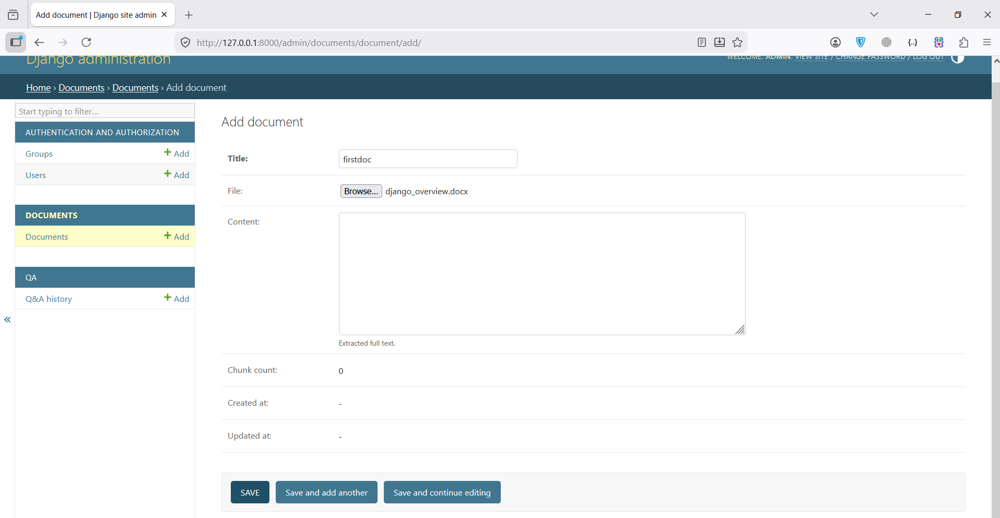
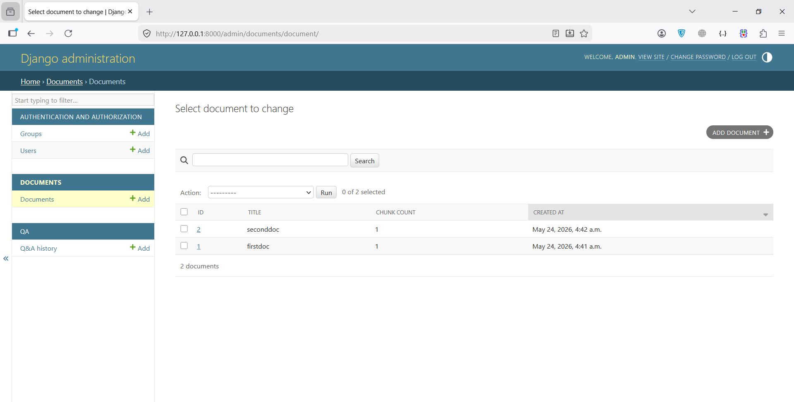
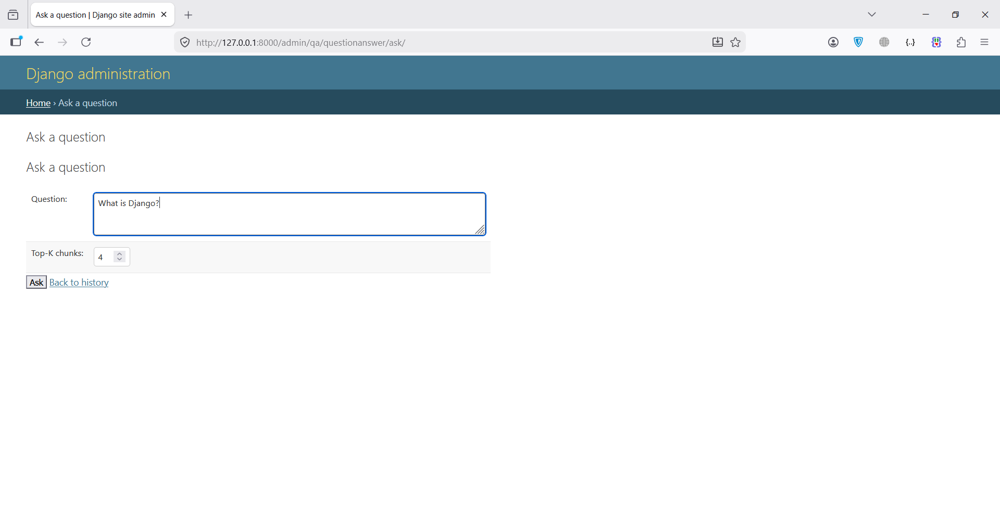
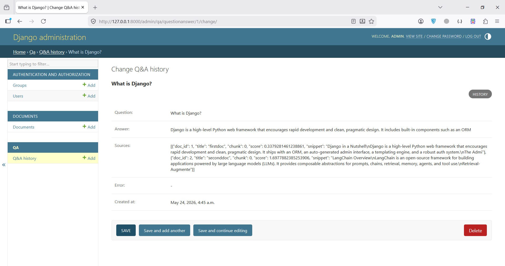
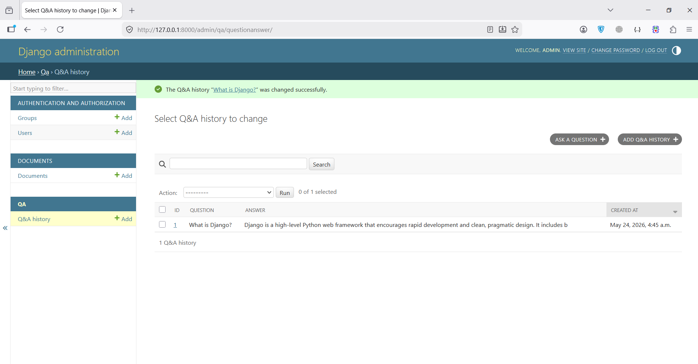

# LLM Document Q&A (Django + LangChain + ChromaDB + OpenRouter)

A Django-based question-answering system over uploaded DOCX documents,
using LangChain for the RAG pipeline, ChromaDB as the vector store,
SentenceTransformers for local embeddings, and an OpenRouter free model
for answer generation. The entire UI is provided by Django Admin.

---

# Screenshots


| Add Document | List Documents | Ask Question | Answer Display | Question History |
|:---:|:---:|:---:|:---:|:---:|
|  |  |  |  |  |
---


## Features

- Upload, edit, and delete DOCX documents (full text auto-extracted and stored).
- Automatic chunking, embedding, and indexing into ChromaDB.
- Ask questions through Django Admin **or** the REST API.
- Retrieves the top-K relevant chunks and generates grounded answers with citations.
- Stores the full history of questions, answers, sources, and any errors.
- OpenAPI / Swagger documentation at `/api/docs/`.
- Includes sample DOCX files in `sample_data/`.
- Includes screenshots of the admin UI inside `screenshots/`.

---

## Stack

- **Django 5**
- **Django REST Framework**
- **drf-spectacular**
- **LangChain**
  - `langchain`
  - `langchain-openai`
  - `langchain-chroma`
  - `langchain-text-splitters`
- **ChromaDB** persistent vector store
- **SentenceTransformers** (local embedding model)
- **OpenRouter**
  - Default free model:
    `meta-llama/llama-3.1-8b-instruct:free`
- **python-docx** for DOCX parsing
- SQLite (default zero-config database)

---

# Quick Start

## 1. Get an OpenRouter API key

Create a free API key:

- https://openrouter.ai/keys

---

## 2. Configure the environment

Create a `.env` file:

```bash
cp .env.example .env
```

Then edit `.env` and set:

```env
OPENROUTER_API_KEY=your_key_here
```

---

## 3. Run with Docker

```bash
docker compose up --build
```

On first startup the container will:

- apply migrations
- create the superuser automatically from `DJANGO_SUPERUSER_*`
- download the SentenceTransformer embedding model locally
- launch Gunicorn on port `8000`

Default admin credentials:

```text
username: admin
password: admin12345
```

---

## 4. Open the Admin Panel

Admin URL:

```text
http://localhost:8000/admin/
```

Swagger / OpenAPI docs:

```text
http://localhost:8000/api/docs/
```

---

## 5. Upload Sample Documents

Inside the `sample_data/` folder you can find sample DOCX files such as:

- `langchain_overview.docx`
- `django_overview.docx`

Upload them from:

```text
Documents → Documents → Add
```

After upload, the system automatically:

1. extracts the DOCX text
2. splits it into chunks
3. generates embeddings
4. stores vectors inside ChromaDB

---

## 6. Ask Questions

Go to:

```text
Qa → Q&A History → Ask a question
```

Example:

```text
What is Retrieval-Augmented Generation?
```

The generated answer and source snippets will be stored in the database.

---

# Regular User Access

If you want to log in as a normal user instead of creating your own account,
you can use the default credentials below:

```text
username: admin
password: admin12345
```

You can also change these credentials from the `.env` file using:

```env
DJANGO_SUPERUSER_USERNAME=
DJANGO_SUPERUSER_PASSWORD=
DJANGO_SUPERUSER_EMAIL=
```

---

# REST API

Interactive documentation:

```text
http://localhost:8000/api/docs/
```

| Method | Path                      | Purpose                                  |
| ------- | ------------------------- | ---------------------------------------- |
| GET     | `/api/documents/`         | List documents                           |
| POST    | `/api/documents/`         | Upload a document                        |
| GET     | `/api/documents/{id}/`    | Retrieve a document                      |
| PUT     | `/api/documents/{id}/`    | Update a document                        |
| PATCH   | `/api/documents/{id}/`    | Partial update                           |
| DELETE  | `/api/documents/{id}/`    | Delete document and embeddings           |
| POST    | `/api/ask/`               | Ask a question                           |
| GET     | `/api/history/`           | List Q&A history                         |
| GET     | `/api/history/{id}/`      | Retrieve a single Q&A entry              |

---

## Example: Upload a Document

```bash
curl -u admin:admin12345 \
     -F "title=LangChain Overview" \
     -F "file=@sample_data/langchain_overview.docx" \
     http://localhost:8000/api/documents/
```

---

## Example: Ask a Question

```bash
curl -u admin:admin12345 \
     -H "Content-Type: application/json" \
     -d '{"question": "What is Retrieval-Augmented Generation?", "k": 4}' \
     http://localhost:8000/api/ask/
```

Example response:

```json
{
  "id": 1,
  "question": "What is Retrieval-Augmented Generation?",
  "answer": "Retrieval-Augmented Generation (RAG) combines a retriever ...",
  "sources": [
    {
      "doc_id": 1,
      "title": "LangChain Overview",
      "chunk": 1,
      "score": 0.21,
      "snippet": "Retrieval-Augmented Generation (RAG) combines ..."
    }
  ],
  "created_at": "2025-05-20T12:00:00Z"
}
```

---

# Architecture

```text
                    ┌──────────────────────┐
   DOCX upload ───► │ documents.admin /    │
                    │ documents.serializer │
                    └──────────┬───────────┘
                               │
                               ▼
                    extract_docx_text()
                               │
                               ▼
                        Document.content
                               │
                               ▼
                           reindex()
                               │
                               ▼
                    ┌──────────────────────┐
                    │ qa.rag.index_document│
                    └──────────┬───────────┘
                               │ embeddings
                               ▼
                        ┌──────────────┐
                        │   ChromaDB   │
                        │ (persistent) │
                        └──────┬───────┘
                               │ similarity_search
                               ▼
 Question (Admin/API) ─────► answer_question()
                               │
                               ▼
                    LangChain Prompt + OpenRouter LLM
                               │
                               ▼
                      Answer + source snippets
                               │
                               ▼
                        QuestionAnswer
```

---

# Important Files

| File | Description |
| ---- | ----------- |
| `qa/rag.py` | Complete RAG pipeline |
| `documents/models.py` | `Document` model + DOCX extraction |
| `documents/admin.py` | Admin upload + indexing logic |
| `qa/admin.py` | Custom admin Q&A page |
| `qa/views.py` | REST API endpoints |

---

# Running Without Docker (Optional)

```bash
python -m venv .venv
source .venv/bin/activate

pip install -r requirements.txt

export $(grep -v '^#' .env | xargs)

python manage.py makemigrations
python manage.py migrate

python manage.py createsuperuser

python manage.py runserver
```

---

# Notes

- SQLite and ChromaDB data are persisted under `./data/`.
- Deleting the `data/` directory resets the system.
- The embedding model is downloaded locally using SentenceTransformers.
- If `OPENROUTER_API_KEY` is invalid or missing,
  `/api/ask/` returns HTTP `502`.
- Any OpenRouter model can be used via:

```env
LLM_MODEL=
```

---

# PostgreSQL Recommendation

For production deployments, PostgreSQL is recommended instead of SQLite.

If PostgreSQL is used, it is highly recommended to use:

- **pgvector**

This allows vector embeddings to be stored directly inside PostgreSQL
and enables efficient similarity search at scale.

---

# Screenshots

- `screenshots/add_question.PNG `
- `screenshots/answer_question.PNG`
- `screenshots/ask_question.PNG`
- `screenshots/list_documents.PNG`
- `screenshots/list_questions.PNG`
- `screenshots/add_document.PNG`

---

# Sample Data

The `sample_data/` directory contains example DOCX files
that can be uploaded immediately for testing the system.

---
